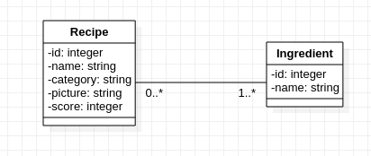

# API Fond de Placard

## Contexte
Nous aimerions créer une application communautaire permettant de donner des idées de repas aux gens selon ce qu'il reste
dans leurs placard. L'application s'appelle Fond de Placard et voici les différentes fonctionnalités que nous avons identifiées :

La core feature sera de pouvoir rechercher une liste de recettes possibles en indiquant les ingrédients que l'on a à sa disposition.

Toustes les utilisateur·ices de l'application auront la possibilité d'ajouter des recettes simplifiées composées uniquement des ingrédients de celle ci (le but n'est pas de faire de vraies recettes détaillées mais juste de données des idées de repas).

Le choix des ingrédient se fera avec une barre d'autocomplétion. Si un ingrédient n'est pas présent, il sera possible de le rajouter à la liste.

Nous souhaitons également proposer un système d'upvote et downvote afin de pouvoir ordonancer les recettes.

Si vous avez le temps ou pour une version 1.2, nous aimerions également permettre aux utilisateur·ices de proposer une correction aux recettes existantes, et que celle ci soit validé par 2 ou 3 autres personnes avant d'être mise en place.

## Entités

Le diagramme est relativement simple, il ne prend pas en compte les corrections et leur validation actuellement.

## Contraintes techniques
Pour le moment, nous souhaitons ne réaliser que l'API Rest de l'application, nous voulons ne dépendre d'aucun framework, aussi pour la V1, nous vous demandons de la réaliser from scratch. Ceci dit par la suite nous pourrions vouloir en utiliser, veillez donc à le permettre sans devoir recoder l'intégralité de l'application. Il faut également que l'application respecte les principes SOLID autant que faire se peut.

Vous pouvez choisir le langage que vous préférez.

## Résumé

* Faire l'API Rest d'une appli permettant de trouver des recettes par rapport à des ingrédients
* Pas de langage imposé
* Coder sans framework
* Avoir une couche business et tenter de la découpler de l'infrastructure